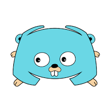
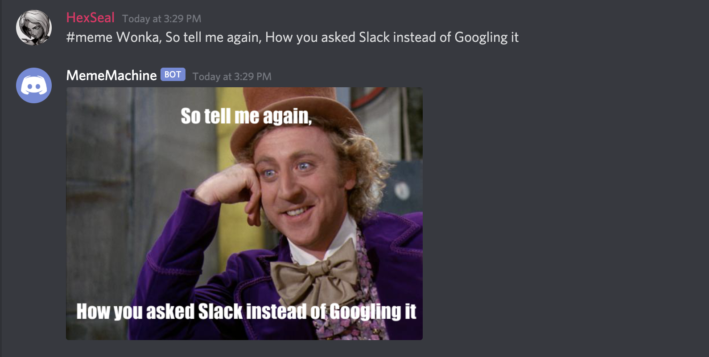

<h1> Meme Machine </h1>

<h3>A Discord bot for custom meme images, written in Go</h3>

 Host and add it to your server(need server manage permissions):

https://discord.com/api/oauth2/authorize?client_id=766006954769776690&permissions=0&scope=bot

To run it: 
<pre>go run main.go -t (your bot token here)</pre>

 

 To create a meme: 

 - Call the bot in chat:

    <pre>#meme</pre>

 - Choose the format(for now, the seperator is a comma)

    <pre>wonka,</pre>

 - Add Your captions:

    <pre>So tell me again, How you asked Slack instead of Googling it</pre>

And the bot will post the image directly into chat!

Working meme formats(more will be added):

- Wonka
